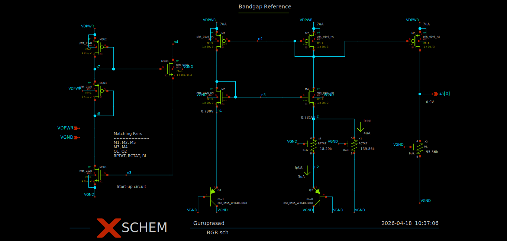

# Design 
All electronic devices are sensitive to temperature variations. If voltage across a device increases
with the increase in temperature, then such devices are called PTAT [Proportional to Absolute Temperature]. 
If voltage decreases with the increase in temperature then such devices are called CTAT
[Complementary to Absolute Temperature]. 

We can achieve a voltage independent of temperature by adding PTAT and CTAT
currents with suitable multiples and passing through a load resistor, such that
net temperature coefficient will be zero. We have used $V_{CE}$ of BJT as CTAT whose temperature 
coefficient is $-1.86\ mV/^\circ C$ . Similarly, the extracted thermal voltage $V_T$ has a PTAT 
temperature coefficient of $+86\mu V/^\circ C$ .

The PTAT current is generated using *n* number of BJTs connected in parallel.

$$I_{PTAT}=\frac{V_T\ln(n) R_L}{R_{PTAT}}$$

Similarly, The CTAT current is generated using a single BJT with voltage
$V_{n1}$ across it.

$$I_{CTAT}=\frac{V_{n1}}{R_{CTAT}}$$

Finally, reference voltage is generated by passing both types of
currents $R_L$.
 
$$V_{REF}=\frac{V_T\ln(n)}{R_{PTAT}}+ \frac{V_{n1}R_L}{R_{CTAT}}$$

To achieve zero temperature coefficient,

$$\frac{R_{CTAT}}{R_{PTAT}}=10.47$$

The obtained values of the above mentioned parameters are -

$$I_3=7\mu A,\ n=8,\ R_{PTAT}=18.29k\Omega ,\ R_{CTAT}=139.86k\Omega ,\ R_L=95.56k\Omega $$

Since the circuit has two operating points, a startup circuit is required. The following figure 
shows the final schematic of BGR.

MOSFETS form $M_1$ to $M_4$ forms a classic beta multiplier. Totally, there are
three main current branches. First one ( $I_1$ ) is $M_1$ , $M_3$ and $Q_1$ . The second one has two sub branches 1. $M_2$ , 
$M_2$ , $R_{PTAT}$ ( $I_{2a}$ ) and $Q_2$ 2. $M_2$ , $M_4$ and $R_{CTAT}$ ( $I_{2b}$ ). While the third one ( $I_3$ ) 
consists of $M_5$ and $R_L$ .

