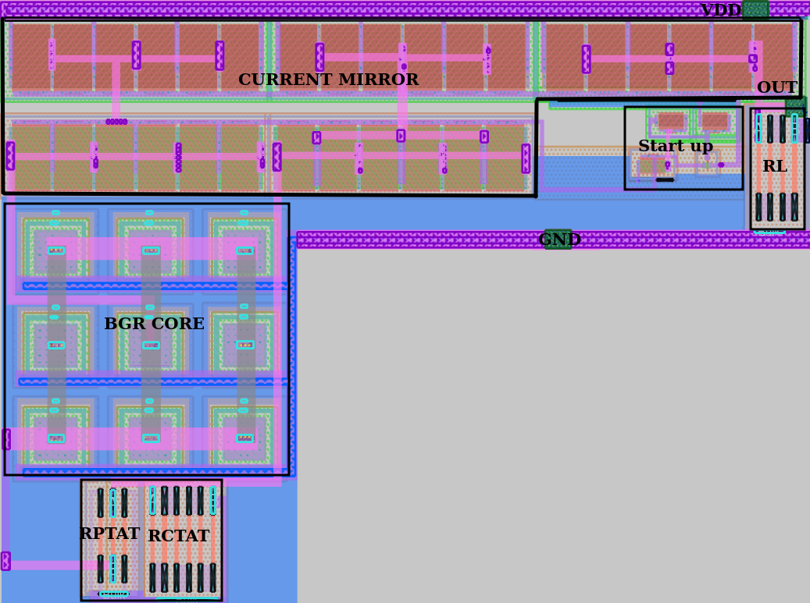

# Layout
- For matching following strategy is used.
    * Place the matching devices adjacent to each other
    * Use W=1 and use multiple fingers to get the required shape
    * Follow the same pattern of routing for matching devices
    * Use dummy devices wisely
    * Since node is 130nm, in most cases it is sufficient.
    * Usually skywater+tineytapeout fabrication is used for academic/research/protot type
          purpose, working stable, reliable model is preferred over accuracy.
- After the layout, fill empty spaces with locali.

- For the BGR, I created the ports of following dimensions
    
    VIN  → 2 µm × 2 µm

    VSS  → 2 µm × 2 µm

    VREF → 1–1.5 µm × 1–1.5 µm

    EN   → 1 µm × 1 µm
-  Metal selection for routing
    
    |Layer  |	Typical use         |
    |-------|-------------------    |
    | Metal1|local device routing   |
    |Metal2	|   signal routing      |
    |Metal3	| power rails / long wires|
    |Metal4+|global routing (in large chips)|

- A port should be placed on the same metal layer that carries the signal to the outside.
    Example:

    |Net        |   Recommended Port Layer  |
    |------     |------                     |
    |VIN        |   metal2                  |
    |VSS	    |   metal2                  |
    |VREF       |metal2 (or metal1 if local)|

- Since our currents are around 3–7 µA, use:

    |Net Type               |	Recommended Width|
    |--------               |   -------             |
    |Local device routing   |	0.3–0.4 µm          |
    |Signal nets (n3, n4 etc.)|	0.4–0.6 µm          |
    |VIN rail	            |   1–2 µm              |
    |VSS rail	            |   1–2 µm              |
    |VREF node	            |   0.4–0.6 µm          |

The layout of the BGR is shown below. Area occupied is $1921\ \mu m^2$.

