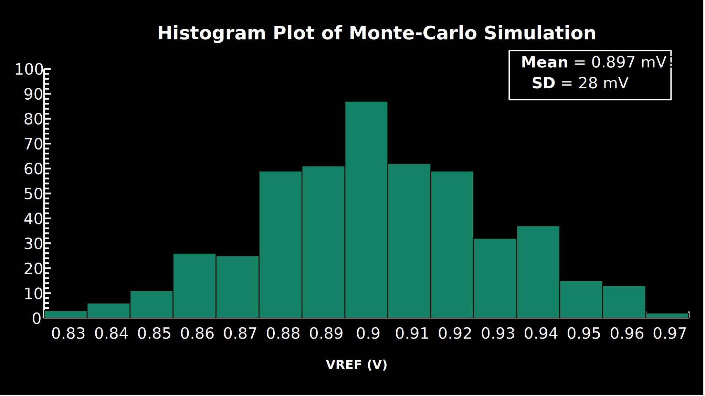

# Simulation
 To  verify the operation of BGR and measure its performance parameters,
following simulations are carried out. There are conducted in two phases
prelayout and postlayout. In this section, results and plots are taken from postlayout 
simulation. The difference in the response from both simulations is minor and 
negligible.

1. Bias
2. Startup
3. Temperature Response
4. Line Response
5. PSRR
6. Monte-Carlo for biasing

Below table shows the corners used for simulations.
|Corner |Process     |Voltage (V)|Temp ( $^\circ C$ )|
|:------|:---------: |:-------:  |:-----------------:|
|1      | TT         |1.8        | 27                |
|2      |SS\_HH      |1.7        | 0                 |
|3      |SS\_HH      |1.7        | 80                |
|4      |SS\_HH      |1.9        | 0                 |
|5      |SS\_HH      |1.9        | 80                |
|6      |FF\_LL      |1.7        | 0                 |
|7      |FF\_LL      |1.7        | 80                |
|8      |FF\_LL      |1.9        | 0                 |
|9      |FF\_LL      |1.9        | 80                |
|10     |SF\_HH      |1.7        | 80                |
|11     |FS\_LL      |1.9        | 0                 |

## Monte-Carlo Simulation
The histogram plot is shown below. Totally 500 samples were considered.

## Result table
|    Parameter      |    Min   |  Nominal |    Max   |  Unit  |         Remarks        |
|:-----------------:|:--------:|:--------:|:--------:|:------:|:----------------------:|
|      Vout         | 0.878301 | 0.899235 | 0.913397 |    V   |           --           |
|       IQ          |   18.4   |   21.8   |   26.1   |   µA   |           --           |
| Line\_Var\_Error  |   2.00   |   2.07   |   2.25   |    %   |       Temp = 27°C      |
| Temp\_Var\_Error  |   22.94  |   35.62  |   38.63  | ppm/°C |       VIN = 1.8V       |
|     PSRR\_DC      |          | -20.8361 |          |   dB   | Temp = 27°C VIN = 1.8V |
|   PSRR\_10kHz     |          |  -20.836 |          |   dB   |                        |
|    PSRR\_1MHz     |          | -19.2342 |          |   dB   |                        |
|   PSRR\_WORST     |          | -9.38166 |          |   dB   |                        |

